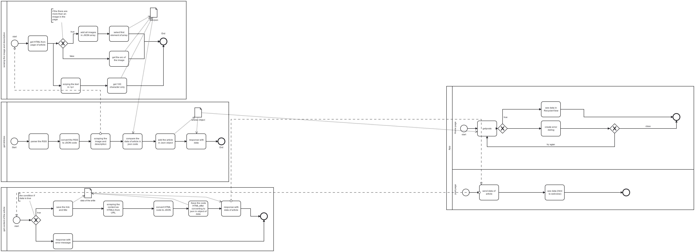

## What is this Project?
it is project for get the rss from website and scraping the image and descrption from the site.

### Algorithm: 


The project by [Sheikh El-Moctar](https://www.facebook.com/SheikhElMoctar/)

## Get Started
First step you need clone the project on Your computer with: 
```
git clone https://github.com/SheikhElMoctarG/SiteApplictionAPI.git
```
then that you to install all libraries through: 
```
npm install
```
## File is Important
to use the project you need file and some the informations: 
file is ``.env``, this file saving the private data and this file not share it with the public because it has important data:
Syntex of `.env` file: 
```
URL_GENERATION = "https://www.example.com" # here we add the domain of our website
SERVER_URL = "https://server.example.com/" # here we add the url of the server after deployed the server on the Internet. 
URL_FEED_RSS = "https://www.example.com/rss.xml" # add url of rss at your website.
CONTENT_HTML = "post-body p" # tag's post (content of the post) -> the text of the post.
IMAGE_TAG = "img" # tag of image in the post's content
POST_BODY = "post-body" #  tag's post (content of the post) -> all content as HTML.
MINS = 5; # the time after the refresh data.
AUTH = "xxxxxxxxxxxxxxxxxxxxxx" # the password for the server, you need it for verfy the requests.
```
to run code on your computer, write this command:
```
node server.js
```
IMPORTANT NOTE: `you may have a problem if your internet is weak`.

# Arabic
## لماذا هذا المشروع؟
المشروع يعمل على جلب البيانات  على شكل الRSS وتحويلها إلى JSON، يقوم بعمل Webscraping و جلب الصور والوصف من الموق.

من قبل [الشيخ المختار](https://www.facebook.com/SheikhElMoctar/)

### البــــــداية:
في الخطوة الأولى يجب ان تقوم بتحميل المستودع في حاسوبك، بالأمر التالي: 
```
git clone https://github.com/SheikhElMoctarG/SiteApplictionAPI.git
```
بعد تحميل المشروع والدخول اليه تقوم بتحميل المكتبات المعتمدة في المشروع على حاسوب دفع واحد بإعتماد الأمر التالي: 
```
npm install
```
### ملف مهم:
في هذا المشروع انت بحاجة لملف تقوم بإضافته إلى ملفات المشروع لديك في الحاسوب واضافة به بعض المعلومات المهمة لكي يعمل المشروع كما يجب، هذا الملف هو `.env `, هذا الملف يتم حفظ به البيانات الخاصة كلمات المرور الخاصة من اجل التحقق من الإتصالات الصحيحة بالسيرفر وبعض العنوانين الخاصة جدا بالمشروع، `ولا ينشر للعن` :
```
URL_GENERATION = "https://www.example.com" # رابط الموقع الذي تريد سحب البيانات منه
SERVER_URL = "https://server.example.com/" # رابط السيرفر الذي تم رفع المشروع عليه. 
URL_FEED_RSS = "https://www.example.com/rss.xml" # عنوان الrss الخاص بموقعك.
CONTENT_HTML = "post-body p" # وسم محتوى المنشور، وهنا يقوم بجلب النص.
IMAGE_TAG = "img" # وسم الصورة، لجلب الصورة
POST_BODY = "post-body" #  وسم من اجل جلب المحتوى كله على شكل html
MINS = 5; # في كل هذا العدد من الدقائق يقوم بعمل اعادة فحص للموقع.
AUTH = "xxxxxxxxxxxxxxxxxxxxxx" # كلمة المرور التي من خلالها سيعرف النظام ان الطلب من سيرفر تابع له.
```
لتشغيل المشروع تقوم بتمرير الأمر التالي : 
```
node server.js
```

ملاحظة هامة: `قد يظهر لك بعض المشاكل بعد التشغيل، والأمر طبعا بسبب العمليات الضخمة على شبكة الانترنت لديك، وهذا يعني الانترنت لديك ليس قوي جدا`.
